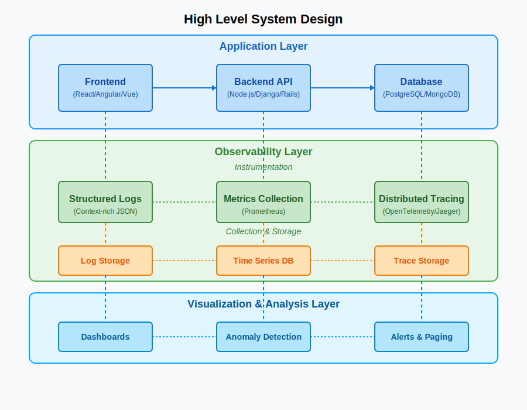
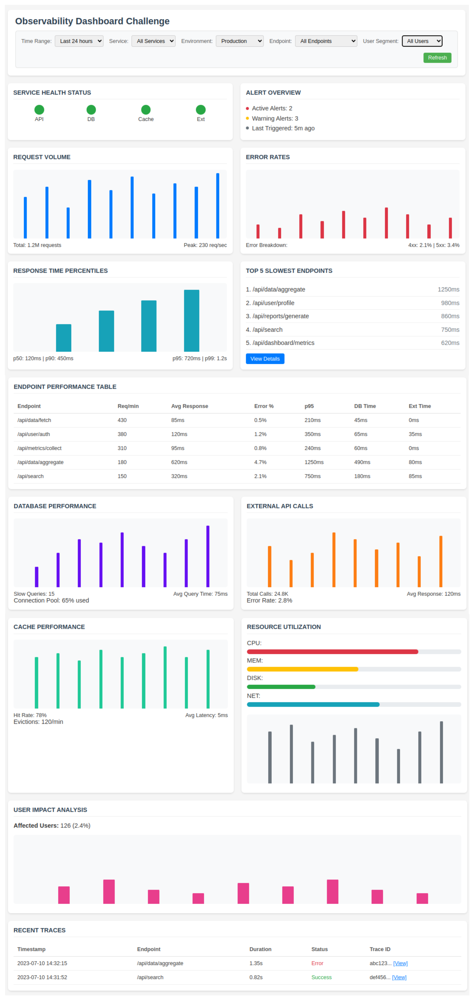

## Problem Statement

The engineering team is facing a painful debugging experience where finding the root cause and correct actions for software issues is challenging because:

- Debugging processes are slow, repetitive, and heavily manual
- The team relies too much on a few experienced engineers
- Existing logs were added long ago and lack relevance to current system behavior
- New software releases take too long to debug when broken or malfunctioning

## System-design




## Technical Implementation

I propose a three-pillar observability approach utilizing OpenTelemetry as a vendor-neutral framework:

1. **Metrics collection**
2. **Structered logging with context**
3. **Distributed tracing**

The application implements a simple API server that simulates backend operations (database queries, external API calls, cache operations) to demonstrate how instrumentation helps identify performance bottlenecks and errors.

## Key Features

### 1. Request Tracing
- Every incoming HTTP request generates a trace with unique trace ID
- Child spans created for database operations, API calls, and cache lookups
- Performance timing recorded at each step
- Trace context propagation across different operations

### 2. Structured Logging
- JSON-formatted logs with consistent fields
- Correlation between logs and traces via trace_id and span_id
- Contextual information included in all log entries
- Request parameters and response details logged at appropriate levels

### 3. Error Handling
- Simulated errors include database query timeouts and external API failures to demonstrate issue detection.
- Errors are captured in traces (`span.RecordError`) and logs with detailed context (e.g., error message, duration).

### 4. Simulated Operations
- `simulateDBQuery`: Simulates database operations with variable latency
- `simulateExternalAPICall`: Simulates external API requests with occasional failures
- `simulateCacheOperation`: Simulates cache operations with hit/miss patterns

## How to Run

### Prerequisites
- Go 1.16 or higher
- In a production environment, you would need:
  - OpenTelemetry Collector for receiving traces

### Starting the Server

Run the application in the background:
```bash
go run observability.go 
```

The application will start and listen on port 8080. You'll see startup logs like:
```
{"level":"info","timestamp":"2023-03-30T19:52:57.394+0530","caller":"atlan-solution-observability/observability.go:434","msg":"Starting server","port":"8080"}
{"level":"info","timestamp":"2023-03-30T19:52:57.394+0530","caller":"atlan-solution-observability/observability.go:435","msg":"Observability enabled","tracing":true,"metrics":true,"structured_logging":true}
```

### Making API Requests

To test the application, send requests to the API endpoint:
```bash
curl "http://localhost:8080/api/items?user_id=demo123"
```

This will return a JSON response:
```json
{"status":"success","cache_hit":true,"items":1}
```

### Checking Health Status

To check the health of the application:
```bash
curl "http://localhost:8080/health"
```

Response:
```json
{"status":"up"}
```

## Important Note on Backend Services

You'll see warning or error messages about OTLP exporter failing to connect:
```
traces export: context deadline exceeded: rpc error: code = Unavailable desc = dns: A record lookup error: lookup otel-collector on 127.0.0.53:53: server misbehaving
```

This is expected when running the demo without an OpenTelemetry Collector. 

## Dashboard




